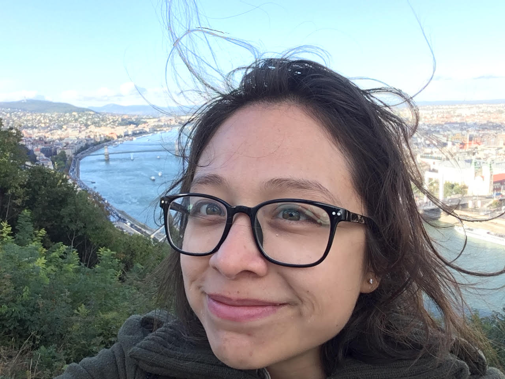

## Airam Blancas

Since August 2020, I am associate professor in the Department of Statistics at [ITAM](https://www.itam.mx). 

My research interests are in the development of probability theory and stochastic processes to describe the genetic structure of populations under the action of evolutionary forces.  

I completed my PhD in Probability and Statistics at [CIMAT](https://www.cimat.mx) in 2016, co-supervised by [Victor Rivero](https://www.cimat.mx/~rivero/vrivero/Welcome.html) and [Arno Siri-Jegousse](http://sigma.iimas.unam.mx/arno/). Then, I got a CONACyT postdoctoral fellow to collaborate for two years in the group of [Anton Wakolbinger](https://www.math.uni-frankfurt.de/~ismi/wakolbinger/pers.html) at Goethe University Frankfut in Germany. In 2019, I started a second postdoc co-supervised by [Julia Palacios](https://juliapalacios.github.io) and [Noah Rosenberg](https://rosenberglab.stanford.edu/index.html) at Stanford University.

<td>
<figure>
</figure>
</td>
</tr>

### Publications

- On branching processes with rare neutral mutations.
- Trees within trees: simple nested coalescents. 
- The nested Kingman: speed of coming down from infinity.
